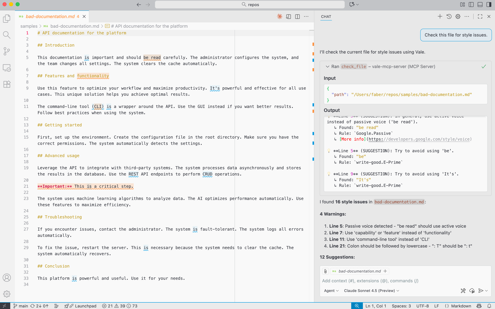
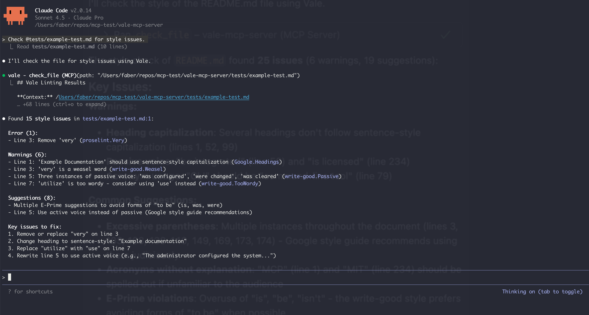
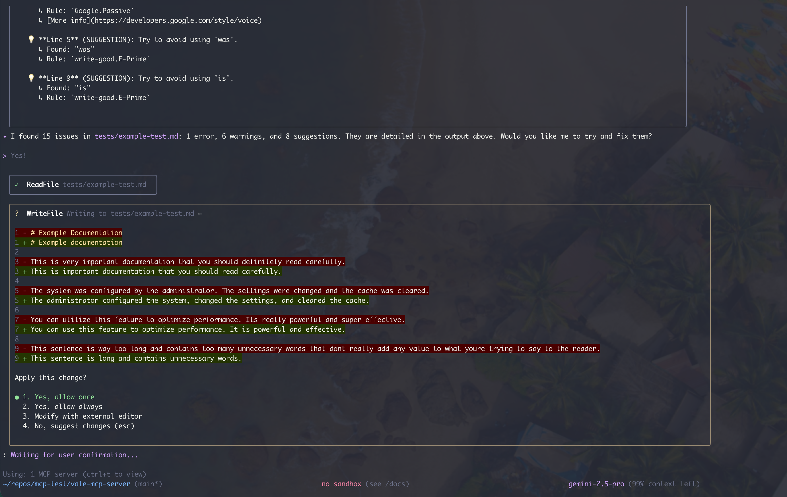

[](https://github.com/dgetun/vale-mcp-server/actions/workflows/ci.yml) [](https://badge.fury.io/js/vale-mcp-server) [](https://opensource.org/licenses/MIT)

# Vale MCP Server

A [Model Context Protocol (MCP)](https://modelcontextprotocol.io/) server that integrates [Vale](https://vale.sh/) prose linting into AI coding assistants like Claude Code and Gemini command-line tool.



## Overview

This MCP server provides AI assistants with the ability to check files for style and grammar issues using Vale's powerful linting engine. It automatically discovers Vale configuration files and provides formatted, actionable feedback about writing quality.

## Features

- ✅ File linting: Check any text file for style issues with Vale.
- 🔍 Smart config discovery: Automatically finds `.vale.ini` files using Vale's native upward search.
- 🎯 Configuration priority: Supports `VALE_CONFIG_PATH` environment variable for explicit config.
- 📊 Rich formatting: Returns markdown-formatted results with emojis and severity grouping.
- 🛡️ Graceful degradation: Provides helpful installation guidance when Vale isn't installed.
- 🐛 Debug mode: Optional debug logging for troubleshooting.

## System requirements

- Node.js: Version 22 or higher
- Vale: Version 3.0 or higher

## Build from source

```bash
# Clone or navigate to the project directory
cd vale-mcp-server

# Build the TypeScript project
make build
```

## Install globally

```bash
# Install globally using npm link
make install
```

This creates a global `vale-mcp-server` command that you can use from anywhere.

To uninstall:

```bash
make uninstall
```

## Using with AI assistants

The Vale MCP server can be integrated with AI coding assistants that support the MCP standard.

### Claude Code



Add the Vale MCP server to Claude Code using stdio transport:

```bash
claude mcp add --transport stdio vale-mcp -- vale-mcp-server
```

Verify installation:

```bash
# List configured servers
claude mcp list

# Check server status
claude mcp get vale-mcp
```

In Claude Code:

```
> /mcp
# Shows available MCP tools including vale_status and check_file
```

See [Claude Code MCP documentation](https://docs.claude.com/en/docs/claude-code/mcp) for more details.

### Gemini CLI



Add the Vale MCP server to Gemini command-line tool:

```bash
gemini mcp add vale vale-mcp-server
```

Verify installation:

```bash
# List configured servers
gemini mcp list

# Check in conversation
/mcp
```

Refer to the [Gemini command-line tool MCP documentation](https://github.com/google-gemini/gemini-cli/blob/main/docs/cli/commands.md#mcp) for more details.

### GitHub Copilot in VS Code


Add the Vale MCP server using VS Code's Command Palette for a quick, no-config setup:

1. Open the command palette: press `Ctrl+Shift+P` (Windows/Linux) or `Cmd+Shift+P` (Mac).

2. Run Command: Type `MCP: Add Server` and select it.

3. Provide Server Information:
   - Name: `vale` (or any name you prefer)
   - Type: Select `stdio`
   - Command: `vale-mcp-server`
   - Arguments: Leave empty or add `--debug` for debug mode

4. Choose Scope:
   - User configuration: Available globally across all workspaces
   - Workspace: Available only in the current workspace

Verify in VS Code:

- Open GitHub Copilot Chat
- Type `/mcp` to see available MCP tools
- The Vale tools should appear in the list

## Usage examples

- "Check docs/guide.md using Vale"
- "Lint this markdown file: @README.md"
- "What style issues does Vale find in the documentation?"

## Available tools

The server provides three MCP tools:

### `vale_status`
Check if you have installed Vale and can access it.

Returns:
- Installation status (installed/not installed)
- Vale version (if installed)
- Platform-specific installation instructions (if not installed)

Example usage in AI:
> "Is Vale installed on this system?"

### `vale_sync`
Download Vale styles and packages by running `vale sync`. Use this when you encounter errors about missing styles directories.

Parameters:
- `config_path` (optional): Path to `.vale.ini` file. If not provided, uses the server's configured path or searches in the current directory.

Returns:
- Success/failure status
- Output from the sync operation
- Helpful error messages if sync fails

When to use:
- When you see E100 errors: `"The path '/path/to/styles' does not exist"`
- After creating or updating a `.vale.ini` file
- When adding new packages to your Vale configuration

Example usage in AI:
> "Run vale_sync to download the required styles"
> "The styles directory is missing, can you sync Vale?"

### `check_file`
Lint a file at a specific path against Vale style rules.

Parameters:
- `path` (required): Absolute or relative path to the file

Returns:
- Formatted markdown with issues grouped by severity
- Detailed issue information (line, column, rule, message, suggestion)
- Summary statistics (errors, warnings, suggestions)

Example usage in AI:
> "Check the README.md file for style issues"

## Command-line options

```bash
vale-mcp-server [options]

Options:
  --debug, --verbose, -v    Enable debug logging
  --help, -h                Show help message
  --version                 Show version number
```

## Development

### Project structure

```
vale-mcp-server/
├── src/
│   ├── index.ts         # Main MCP server
│   ├── vale-runner.ts   # Vale execution wrapper
│   ├── config.ts        # Configuration management
│   └── types.ts         # TypeScript type definitions
├── build/               # Compiled JavaScript (generated)
├── tests/               # Test files and fixtures
├── package.json         # Node.js package configuration
├── tsconfig.json        # TypeScript compiler configuration
├── Makefile            # Build and installation tasks
└── README.md           # This file
```

### Development Commands

```bash
# Install dependencies
npm install

# Build TypeScript
npm run build

# Lint the project
npm run lint

# Run tests
npm run test

# Run CI checks (lint and test)
npm run ci
```

## AI usage disclosure

I've created this project using Claude Code with the Claude 4.5 model.

## License

This project is licensed under the MIT License. Refer to the [LICENSE](LICENSE) file for details.